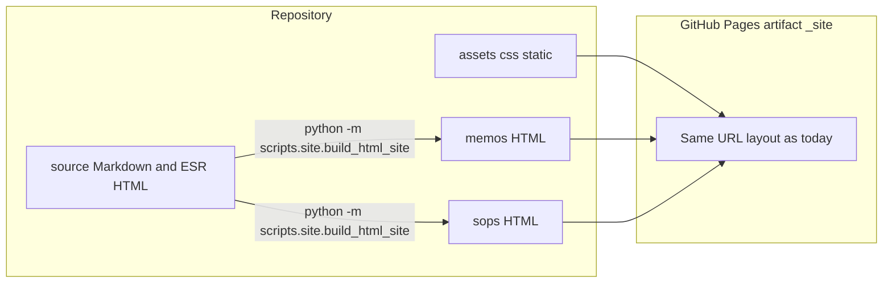

# Repository layout (source vs published)

This repo separates **authoring inputs** from **what gets served** on GitHub Pages.

## Folders

| Path | Role |
|------|------|
| [`source/`](source/) | **Authoring**. Markdown for memos/SOPs, jukebox/tools, etc. |
| [`memos/`](memos/), [`sops/`](sops/) | **Published** HTML for memorandums and SOPs (root-level URLs `/memos/...`, `/sops/...`). |
| [`assets/`](assets/) | PDFs, images, Word templates (`assets/word/...`), data files. |
| [`index.html`](index.html), [`css/`](css/), [`static/`](static/) | Site shell, styles, shared JS. |
| [`content/HTML/esr-class/`](../../content/HTML/esr-class/) | **Published** ESR slide HTML (served under **`/content/esr-class/`** on Pages). |
| [`scripts/`](../../scripts/) | Python tooling (**`scripts/site`**, **`scripts/word`**, **`scripts/sops`**). |

## ESR class URL vs repo path

Visitors use paths like **`/content/esr-class/esr/main/sl1-esr-key.html`**. In CI, GitHub Actions copies [`content/HTML/esr-class/`](../../content/HTML/esr-class/) to **`_site/content/esr-class/`** so the **`content`** segment in the URL stays stable while the deck lives under **`content/HTML/`** in the repository.

## Tooling

See [`scripts/README.md`](../../scripts/README.md) and [`CONTRIBUTING.md`](../../CONTRIBUTING.md).
